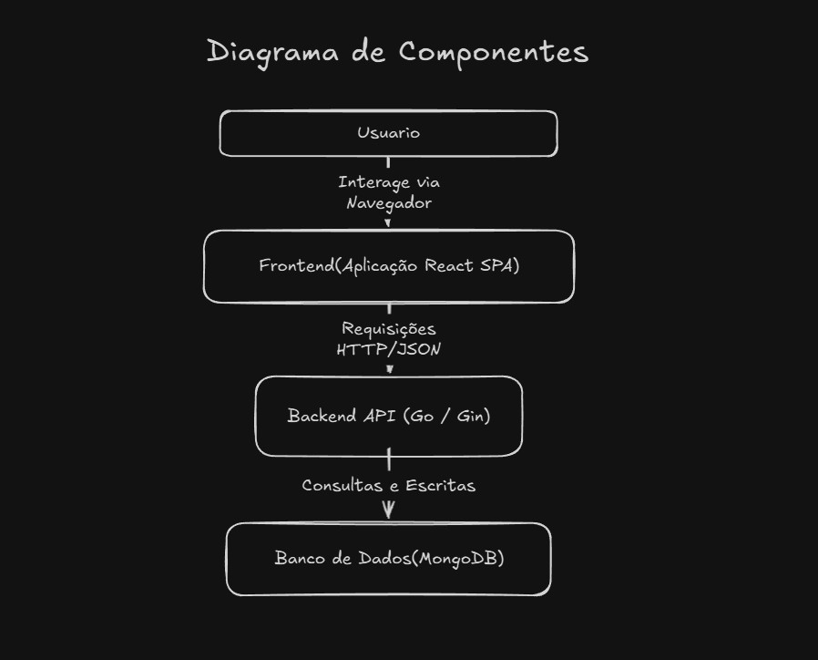
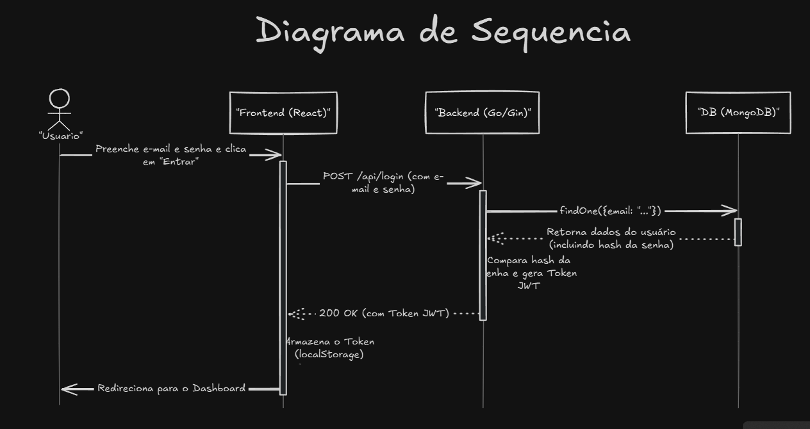

# Projeto de Controle de Voluntários - ELLP

## 1. Descrição do Projeto

Este projeto foi desenvolvido para a disciplina de **ES47C/IF66K - Oficina de Integração 2**. O objetivo é criar um sistema de gerenciamento interno para os voluntários do projeto de extensão **ELLP - Ensino Lúdico de Lógica e Programação**.

O sistema aborda a seguinte temática:
> Controle de voluntários do projeto (cadastro, datas de entrada e saída, oficinas que já trabalharam e geração de termo de voluntariado).

**Equipe:**
* Ryan Miura Carrasco
* Daniel Rodrigues
* Henrique Nogarini

## 2. Requisitos Funcionais

O escopo do projeto foi detalhado nos seguintes requisitos funcionais para compor o backlog:

* **RF01 - Autenticar Usuário:** Como membro do ELLP, ao acessar o sistema, devo ser direcionado para uma tela de login onde preciso inserir minhas credenciais para ter acesso.
* **RF02 - Realizar Logout:** Como membro do ELLP, eu quero ter a opção de "Sair" (Logout) do sistema para encerrar minha sessão de forma segura.
* **RF03 - Cadastrar Novo Voluntário:** Como membro do ELLP, eu quero poder cadastrar um novo voluntário no sistema, informando dados como nome completo, e-mail, telefone, curso, e data de entrada no projeto.
* **RF04 - Listar e Buscar Voluntários:** Como membro do ELLP, eu quero visualizar uma lista com todos os voluntários cadastrados, com a opção de buscar por nome para encontrar rapidamente um voluntário específico.
* **RF05 - Visualizar Detalhes do Voluntário:** Como membro do ELLP, eu quero poder clicar em um voluntário na lista para ver todas as suas informações em uma página dedicada.
* **RF06 - Editar Voluntário:** Como membro do ELLP, eu quero poder editar as informações de um voluntário existente para corrigir ou atualizar seus dados.
* **RF07 - Inativar Voluntário:** Como membro do ELLP, eu quero poder marcar um voluntário como "inativo" e registrar sua data de saída, para manter o histórico de sua participação.
* **RF08 - Gerenciar Oficinas:** Como membro do ELLP, eu quero poder cadastrar, editar e visualizar as oficinas que o projeto oferece, informando nome e data de realização.
* **RF09 - Associar Voluntários a Oficinas:** Como membro do ELLP, ao visualizar os detalhes de uma oficina, eu quero poder associar um ou mais voluntários que trabalharam nela.
* **RF10 - Visualizar Histórico de Participação:** Como membro do ELLP, na página de detalhes de um voluntário, eu quero ver a lista de todas as oficinas em que ele já participou.
* **RF11 - Gerar Termo de Voluntariado:** Como membro do ELLP, na página de detalhes de um voluntário, eu quero clicar em um botão para gerar e baixar um "Termo de Voluntariado" em formato PDF.
* **RF12 - Preencher Termo Dinamicamente:** O sistema deve preencher o Termo de Voluntariado automaticamente com o nome completo do voluntário, seu período de atuação e a lista de oficinas em que atuou.

## 3. Arquitetura do Sistema

A arquitetura do sistema é baseada no modelo Cliente-Servidor em três camadas. O acesso à aplicação é restrito a usuários autenticados.

1.  **Frontend (Cliente):** Uma Single-Page Application (SPA) em React.
2.  **Backend (Servidor):** Uma API RESTful em Go (Gin), que implementa a lógica de negócio.
3.  **Banco de Dados:** Uma instância do MongoDB para a persistência dos dados.




## 4. Tecnologias Utilizadas

As seguintes tecnologias foram selecionadas para o desenvolvimento do projeto:

| Categoria | Tecnologia | Descrição |
| :--- | :--- | :--- |
| **Backend** | Go | Linguagem de programação para a construção do servidor. |
| | Gin | Framework web para a criação da API RESTful. |
| **Frontend** | React | Biblioteca para a construção da interface de usuário. |
| | React Router | Para gerenciamento de rotas na aplicação. |
| | Axios | Cliente HTTP para comunicação com a API. |
| | Tailwind CSS | Framework de estilização para o design da interface. |
| **Banco de Dados** | MongoDB | Banco de dados NoSQL orientado a documentos. |
| **Automação**| GitHub Actions | Para automação da execução dos testes (CI). |

## 5. Estratégia de Testes e Automação

Para garantir a qualidade do software, a estratégia será focada em testes de unidade automatizados.

* **Testes de Unidade (Backend):** As funções de lógica de negócio em Go serão testadas de forma isolada utilizando o pacote nativo `testing`.
* **Testes de Unidade (Frontend):** Os componentes React serão testados individualmente com **Jest** para validar seu comportamento.

### Fluxo de Trabalho e Automação (CI)

Adotaremos o seguinte fluxo de trabalho para o desenvolvimento, utilizando o GitHub como repositório:
1.  Para cada nova funcionalidade ou correção (documentada como uma *issue*), uma nova `branch` será criada.
2.  Após o desenvolvimento, um **Pull Request (PR)** será aberto no GitHub para mesclar as alterações.
3.  A abertura do PR acionará automaticamente o **GitHub Actions**, que executará todos os testes de unidade do projeto.
4.  O PR só será mesclado se todos os testes passarem, garantindo a integridade e a qualidade do código na `branch` principal.

## 6. Cronograma de Desenvolvimento

O projeto será desenvolvido utilizando a metodologia Scrum, com a realização de dois sprints. O cronograma macro de desenvolvimento é o seguinte:

| Período | Etapa | Foco e Atividades Principais |
| :--- | :--- | :--- |
| **Semanas 2 a 4** | **Sprint 1** | **Foco:** Construir a base do sistema (CRUD de voluntários e segurança).<br>- **Backlog:** RF01, RF02, RF03, RF04, RF05, RF06, RF07.<br>- **Entregáveis:** Sistema com login funcional, cadastro, listagem, edição e inativação de voluntários. |
| **Semanas 6 a 8** | **Sprint 2** | **Foco:** Agregar funcionalidades de valor (histórico e documentos).<br>- **Backlog:** RF08, RF09, RF10, RF11, RF12.<br>- **Entregáveis:** Funcionalidades de cadastro de oficinas, associação de voluntários e geração do Termo de Voluntariado em PDF. |

# Arquiteturas Especificas

## Backend
``` 
backend/
├── cmd/
│   └── main.go                    # Ponto de entrada da aplicação
├── internal/
│   ├── handlers/                  # Controladores HTTP (ex.: volunteer_handler.go, workshop_handler.go)
│   │   ├── auth_handler.go        # Para login/logout
│   │   └── ...
│   ├── services/                  # Lógica de negócio (use cases)
│   │   ├── volunteer_service.go   # Regras para voluntários
│   │   ├── workshop_service.go    # Regras para oficinas
│   │   └── auth_service.go        # Autenticação
│   ├── models/                    # Entidades de domínio
│   │   ├── volunteer.go           # Structs para Voluntário
│   │   ├── workshop.go            # Structs para Oficina
│   │   └── user.go                # Para usuários autenticados
│   ├── repositories/              # Acesso a dados
│   │   ├── volunteer_repo.go      # Interface e implementação para MongoDB
│   │   ├── workshop_repo.go
│   │   └── interfaces/            # Interfaces para injeção de dependência
│   ├── middleware/                # Middlewares (ex.: auth_middleware.go para JWT)
│   └── config/                    # Configurações (ex.: database.go, jwt.go)
├── pkg/                           # Pacotes compartilhados (ex.: utils para PDF)
│   └── pdf_generator.go           # Para gerar Termo de Voluntariado
├── Dockerfile.dev                 # Já existe
├── go.mod                         # Adicionar dependências: mongo-driver, jwt-go, etc.
└── go.sum
``` 
## Frontend
``` 
frontend/
├── public/
│   ├── vite.svg                   # Já existe
│   └── favicon.ico
├── src/
│   ├── components/                # Componentes reutilizáveis (Atomic Design)
│   │   ├── ui/                    # Componentes base (atoms)
│   │   │   ├── Button/
│   │   │   │   ├── Button.tsx
│   │   │   │   ├── Button.module.css
│   │   │   │   └── index.ts
│   │   │   ├── Input/
│   │   │   ├── Modal/
│   │   │   ├── Card/
│   │   │   └── LoadingSpinner/
│   │   ├── forms/                 # Componentes de formulário (molecules)
│   │   │   ├── VolunteerForm/
│   │   │   ├── WorkshopForm/
│   │   │   └── LoginForm/
│   │   └── layout/                # Componentes de layout (organisms)
│   │       ├── Header/
│   │       ├── Sidebar/
│   │       ├── Footer/
│   │       └── Layout/
│   ├── pages/                     # Páginas principais (templates/pages)
│   │   ├── auth/
│   │   │   ├── LoginPage.tsx      # RF01 - Autenticar Usuário
│   │   │   └── index.ts
│   │   ├── volunteers/
│   │   │   ├── VolunteersListPage.tsx    # RF04 - Listar e Buscar
│   │   │   ├── VolunteerDetailsPage.tsx  # RF05 - Visualizar Detalhes
│   │   │   ├── CreateVolunteerPage.tsx   # RF03 - Cadastrar
│   │   │   ├── EditVolunteerPage.tsx     # RF06 - Editar
│   │   │   └── index.ts
│   │   ├── workshops/
│   │   │   ├── WorkshopsListPage.tsx     # RF08 - Gerenciar Oficinas
│   │   │   ├── WorkshopDetailsPage.tsx   # RF09 - Associar Voluntários
│   │   │   ├── CreateWorkshopPage.tsx
│   │   │   └── index.ts
│   │   └── dashboard/
│   │       └── DashboardPage.tsx
│   ├── hooks/                     # Custom hooks
│   │   ├── useAuth.ts             # Hook para autenticação
│   │   ├── useVolunteers.ts       # Hook para gerenciar voluntários
│   │   ├── useWorkshops.ts        # Hook para gerenciar oficinas
│   │   └── usePDF.ts              # RF11 - Gerar PDF
│   ├── services/                  # Comunicação com API
│   │   ├── api.ts                 # Configuração do Axios
│   │   ├── auth.service.ts        # Serviços de autenticação
│   │   ├── volunteers.service.ts  # CRUD de voluntários
│   │   ├── workshops.service.ts   # CRUD de oficinas
│   │   └── pdf.service.ts         # Geração de PDF
│   ├── store/                     # Gerenciamento de estado (Context API ou Zustand)
│   │   ├── auth/
│   │   │   ├── AuthContext.tsx
│   │   │   └── AuthProvider.tsx
│   │   ├── volunteers/
│   │   │   └── VolunteersContext.tsx
│   │   └── index.ts
│   ├── types/                     # Definições TypeScript
│   │   ├── volunteer.types.ts     # Interfaces para Voluntário
│   │   ├── workshop.types.ts      # Interfaces para Oficina
│   │   ├── auth.types.ts          # Interfaces para Auth
│   │   └── api.types.ts           # Tipos para respostas da API
│   ├── utils/                     # Utilitários e helpers
│   │   ├── constants.ts           # Constantes da aplicação
│   │   ├── formatters.ts          # Formatação de datas, strings, etc.
│   │   ├── validators.ts          # Validações de formulário
│   │   └── helpers.ts             # Funções auxiliares
│   ├── styles/                    # Estilos globais (Tailwind CSS)
│   │   ├── globals.css
│   │   ├── components.css         # Classes customizadas do Tailwind
│   │   └── variables.css          # Variáveis CSS customizadas
│   ├── assets/                    # Já existe
│   │   └── react.svg
│   ├── App.tsx                    # Já existe - Configuração de rotas
│   ├── main.tsx                   # Já existe - Ponto de entrada
│   ├── index.css                  # Já existe
│   └── vite-env.d.ts             # Já existe
├── package.json                   # Adicionar dependências necessárias
├── tailwind.config.js             # Configuração do Tailwind CSS
├── tsconfig.json                  # Já existe
├── vite.config.ts                # Já existe
├── eslint.config.js              # Já existe
└── Dockerfile.dev                # Já existe
```